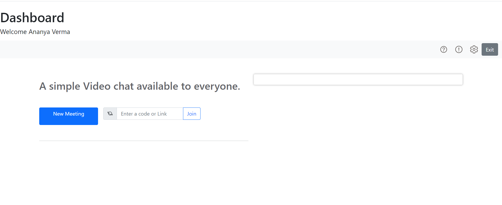
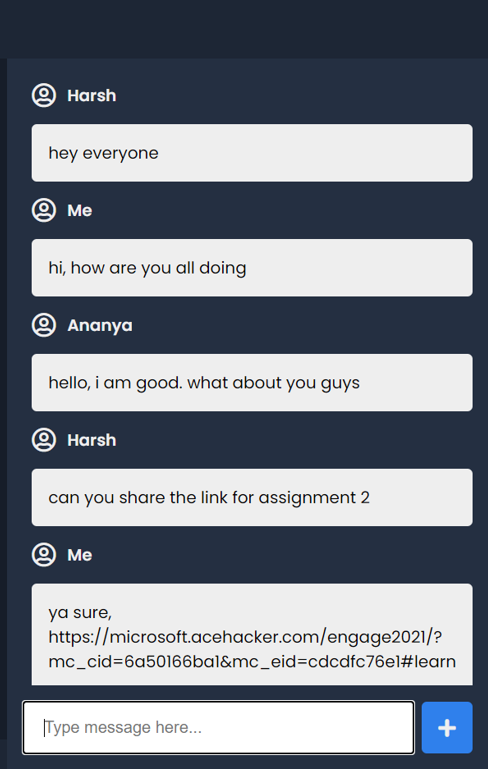
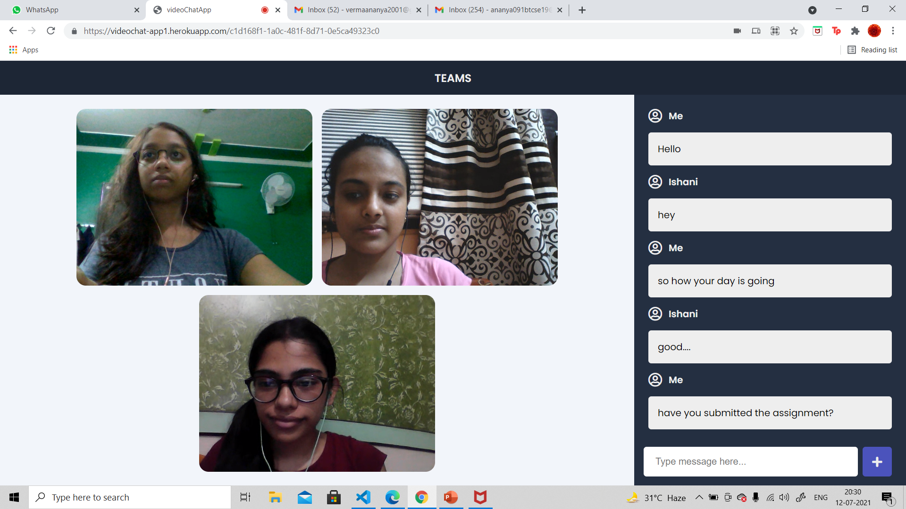

# Microsoft Teams Clone
Hosted App: https://videochat-app1.herokuapp.com/

Demo Video: 

This is a real time video chat web application that I build using the SCRUM framework of Agile Methodology. I created this project as a part of the Microsoft Engage 2021 mentorship program.

# Features 📝
*	Group Video Call of Four Individuals
*	Chat Application accessed during the meeting
*	Screen Presentation during meeting
*Invite Link to share among peers
*	Audio & Video Toggles
* Dashboard
# Tech Stack 💻
**Client: EJS**
* Video Call & Present Screen : Socket.io, peerjs
*	Chat Feature : socket.io connections
*	Styling : bootsrap, css, icons using font awesome
**Server: Node.js, Express.js**

**Deployment: Heroku**

# Dependencies:
* dotenv
* ejs
* express
* express-openid-connect
* nodemon
* peer
* peerjs
* socket.io
* uuid

# Run Locally
For running the application locally, all you need are 3 simple steps!
*	Node and npm Installation
*	Cloning repository
*	Run!
1. Node Installation
*	Node and npm installation on Windows
  Just go on official Node.js website and download the installer. Also, be sure to have git available in       your PATH, npm might need it (You can find git here).
  If the installation was successful, you should be able to run the following command.  
  ```
  $ node --version
  v8.11.3

  $ npm --version
  6.1.0
  ```
  If you need to update npm, you can do it by running following command 
  ```
  $ npm install npm -g
  ```

2. Cloning the Repository
  ```
  $ git clone https://github.com/ananyaverma1/Video-chat-app/
  $ yarn install
  ```

3. Run!
  Finally, Run the following commands!
  ```
  $ npm install 
  $ npm start
  ```

That's it. Go to http://localhost:3030/ to begin right away!
# Demo
As you open the link to the app or run it locally, you'll come across a front page. This is the dashboard. To begin, click on the new meeting to start an instant meeting with your peers.


A bar will pop out requiring you to fill your name and meeting has been hosted.
To invite over other friends in this room, send them the room code. To send them the unique URL click on the user invite button in bottom right corner and copy paste the link and send to your peers. 

As soon as they click on the link, they will be directed to the same meeting.
 
**Chat feature:** On the right side, you see the chat feature to allow users to share important information among users without disturbing the flow of the meeting.


 
When you enter the video call, you'll see your teams video along with yours on the screen. Make sure that more than four people dont join because the room will be filled. On the bottom, you might see some buttons.

**Audo/Video Toggle:** You can stop sharing your audio or video and start sharing them again as you like using these buttons.

**Share Screen:** For sharing your screen click on the button as shown below and then select the tab and press on share. For stop sharing you can click on the same button again.
To leave the meeting, simply close your browser.


# FAQ

**How many of my friends can join?**
A total of 4 people including you can join the call.

**How to invite my friends or team on the call?**
You can copy the link to the call and send invite

**How to get the room code for the call?**
It is the part of the link after / in the URL of the call. For instance, if the link of the room is https://videochat-app1.herokuapp.com/02daac37-5982-4a31-84a7-e0e7a3bad110 then the Room Code will be 02daac37-5982-4a31-84a7-e0e7a3bad110

Hope you enjoy using the application.


